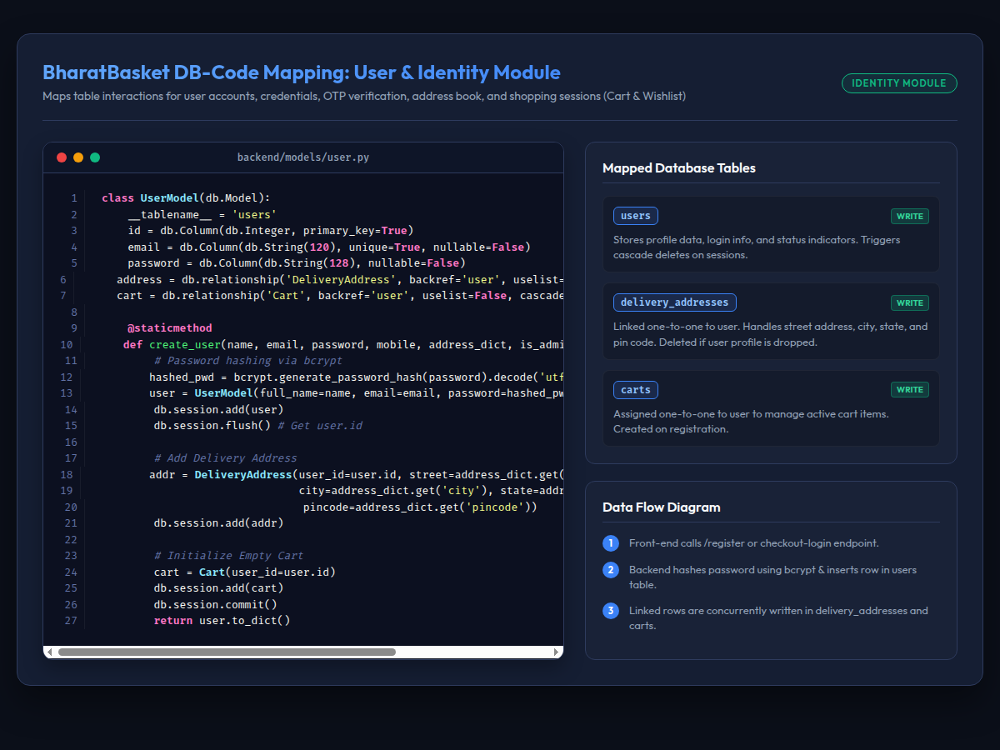
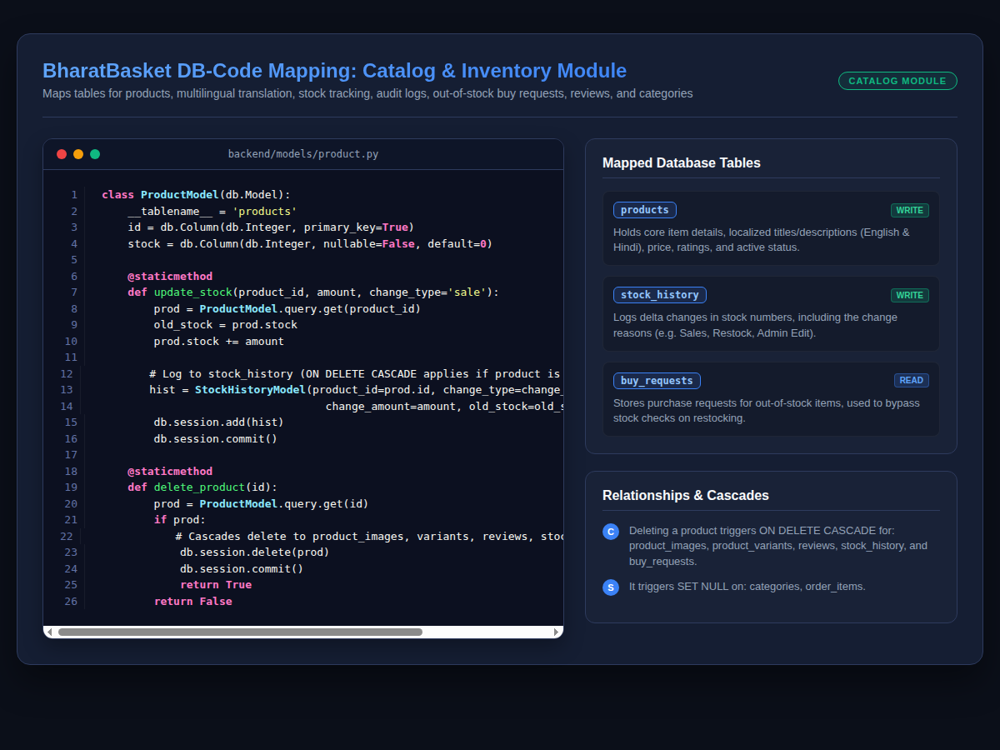
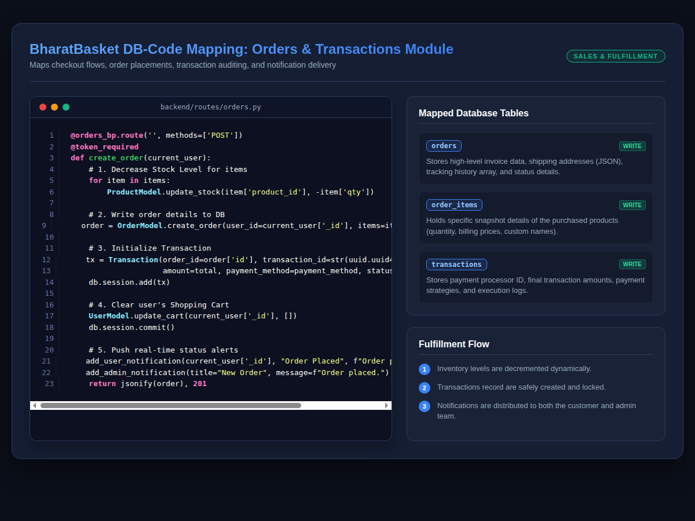
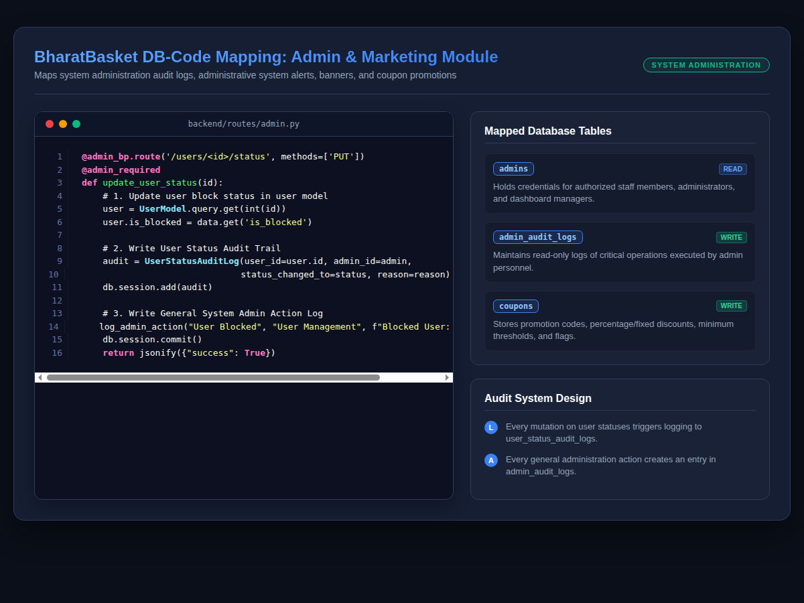
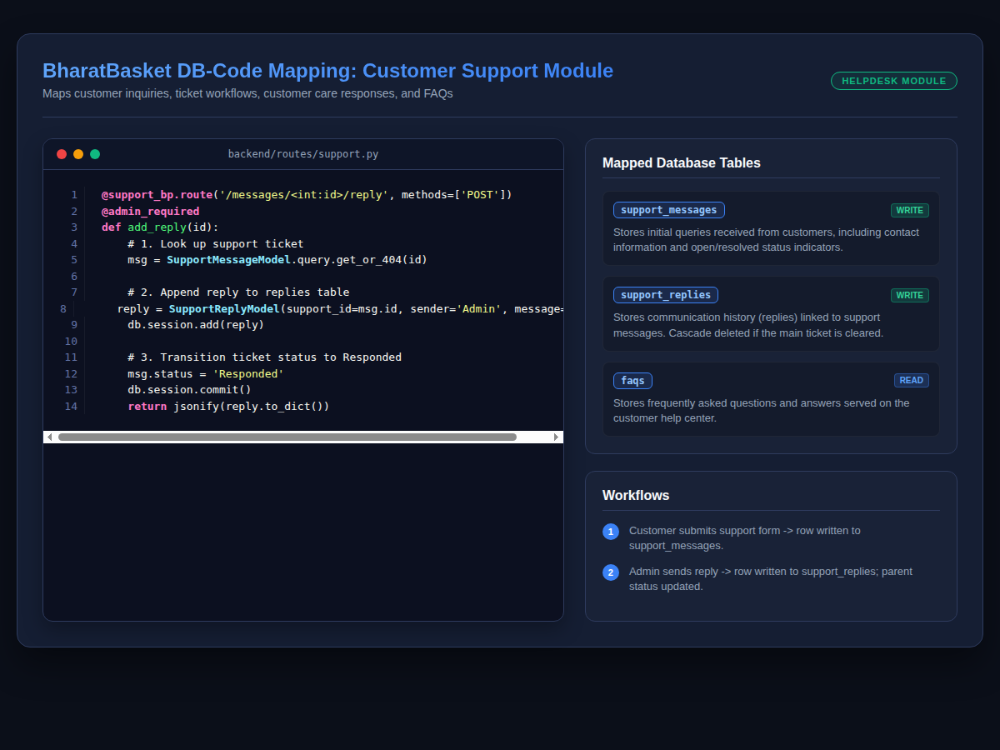

# BharatBasket Database Documentation

This document provides a comprehensive, developer-ready reference for the MySQL database powering the **BharatBasket** e-commerce website. It details the Entity-Relationship Diagram (ERD), full schema specifications for all 28 relational tables, backend code mappings (complete with visual layouts), transactional data flow descriptions, and database maintenance/truncation guidelines.

---

## 1. Entity-Relationship Diagram (ERD)

The following diagram maps out all 28 tables, their primary keys (`PK`), foreign keys (`FK`), unique keys (`UK`), and relational cardinalities (e.g., one-to-many, one-to-one).

```mermaid
erDiagram
    users {
        int id PK
        string full_name
        string email UK
        string password_hash
        string phone
        json notifications
        boolean is_blocked
        boolean is_admin
        boolean email_verified
        datetime created_at
        datetime updated_at
        string microsoft_id UK
        string provider
        string provider_id UK
        datetime last_login
    }

    delivery_addresses {
        int id PK
        int user_id FK
        string house_number
        string building_name
        string street
        string area
        string landmark
        string city
        string state
        string pincode
        string address_type
        boolean is_default
        datetime created_at
    }

    carts {
        int id PK
        int user_id FK "UK"
        datetime created_at
    }

    cart_items {
        int id PK
        int cart_id FK
        int product_id FK
        int quantity
        boolean saved_for_later
        datetime created_at
    }

    wishlists {
        int id PK
        int user_id FK
        int product_id FK
        datetime created_at
    }

    user_status_audit_logs {
        int id PK
        int user_id FK
        string admin_id
        string status_changed_to
        text reason
        datetime created_at
    }

    products {
        int id PK
        string name
        decimal price
        decimal discount
        text description
        json images
        int stock
        int category_id FK
        decimal ratings
        datetime created_at
        datetime updated_at
        datetime discount_applied_at
        json name_translations
        json description_translations
        string created_by
        string modified_by
        string name_en
        string name_hi
        text description_en
        text description_hi
        text features_en
        text features_hi
        text specifications_en
        text specifications_hi
    }

    product_images {
        int id PK
        int product_id FK
        string image_url
        int image_order
        datetime created_at
    }

    product_variants {
        int id PK
        int product_id FK
        string attribute_name
        string attribute_value
    }

    categories {
        int id PK
        string name UK
        datetime created_at
    }

    category_attributes {
        int id PK
        int category_id FK
        string category_name
        string attribute_name
        string attribute_value
    }

    stock_history {
        int id PK
        int product_id FK
        int quantity_changed
        int current_stock
        string change_reason
        datetime created_at
    }

    product_audit_logs {
        int id PK
        int product_id FK
        int admin_id
        string action_type
        string field_name
        text old_value
        text new_value
        datetime created_at
    }

    buy_requests {
        int id PK
        int product_id FK
        int user_id FK
        string product_name
        int quantity
        string selected_variant
        string status
        string expected_delivery_date
        string expected_availability_date
        text admin_note
    }

    orders {
        int id PK
        string order_id UK
        int user_id FK
        decimal total_amount
        string order_status
        string status
        string delivery_date
        json tracking_history
        json return_request
        json shipping_address
        string carrier
        string tracking_id
        datetime created_at
        boolean terms_accepted
        datetime terms_accepted_at
    }

    order_items {
        int id PK
        int order_id FK
        int product_id FK
        int quantity
        decimal price
        string name
        string image
    }

    transactions {
        int id PK
        int order_id FK "UK"
        string transaction_id UK
        decimal amount
        string payment_method
        string status
        datetime created_at
    }

    reviews {
        int id PK
        int product_id FK
        int user_id FK
        string user_name
        int rating
        text comment
        datetime created_at
    }

    admins {
        int id PK
        string username UK
        string password
        datetime created_at
    }

    admin_audit_logs {
        int id PK
        string admin_username
        string action_type
        string module
        text details
        string status
        datetime created_at
    }

    admin_notifications {
        int id PK
        string title
        text message
        boolean read
        datetime created_at
    }

    support_messages {
        int id PK
        string name
        string email
        text message
        string status
        datetime created_at
    }

    support_replies {
        int id PK
        int support_id FK
        string sender
        text message
        datetime created_at
    }

    support_links {
        int id PK
        string title
        string url
        string icon
        boolean is_active
    }

    faqs {
        int id PK
        string question
        text answer
    }

    banners {
        int id PK
        string title
        string subtitle
        text description
        string button_text
        string button_link
        string image_url
        string background_style
        string category
        int display_order
        boolean is_active
        datetime created_at
        datetime updated_at
    }

    notifications {
        int id PK
        string type
        string title
        text description
        int user_id FK
        int order_id FK
        string status
        datetime created_at
        datetime read_at
    }

    otp_verifications {
        int id PK
        string email
        string otp_code
        boolean is_verified
        datetime created_at
        datetime expires_at
        int attempts
        int resend_attempts
        text temporary_user_data
        int user_id FK
    }

    users ||--o{ delivery_addresses : "has"
    users ||--o| carts : "owns"
    users ||--o{ wishlists : "adds"
    users ||--o{ reviews : "writes"
    users ||--o{ orders : "places"
    users ||--o{ buy_requests : "requests"
    users ||--o{ user_status_audit_logs : "audited"
    users ||--o{ notifications : "receives"
    users ||--o{ otp_verifications : "verifies"

    products ||--o{ product_images : "has"
    products ||--o{ product_variants : "has"
    products ||--o{ reviews : "reviewed"
    products ||--o{ cart_items : "carted"
    products ||--o{ wishlists : "wishlisted"
    products ||--o{ order_items : "ordered"
    products ||--o{ stock_history : "logs stock"
    products ||--o{ product_audit_logs : "audited"
    products ||--o{ buy_requests : "back-ordered"
    categories ||--o{ products : "groups"
    categories ||--o{ category_attributes : "specifies"

    carts ||--o{ cart_items : "contains"
    orders ||--o{ order_items : "includes"
    orders ||--o| transactions : "paid by"
    orders ||--o{ notifications : "triggers"
    support_messages ||--o{ support_replies : "replies to"
```



---

## 2. Table Schemas & Constraints

This section provides detailed definitions for each of the 28 tables, grouped by module. All timestamps default to Indian Standard Time (IST/Asia/Kolkata).

### 2.1 Identity & Profile Module

#### `users`
Stores customer accounts and settings.
* **Relationships**:
  - Has many `delivery_addresses` (cascades on delete).
  - Has one `carts` header (cascades on delete).
  - Has many `wishlists` (cascades on delete).
  - Has many `reviews` (restricts on delete).
  - Has many `orders` (sets foreign key to NULL on delete).

| Column | Data Type | Key | Nullable | Default | Description |
| :--- | :--- | :---: | :---: | :--- | :--- |
| `id` | `int` | PK | NO | *Auto Increment* | Primary identifier for the user |
| `full_name` | `varchar(100)` | - | NO | - | Full name of the user |
| `email` | `varchar(100)` | UK | NO | - | Unique login email address |
| `password_hash` | `varchar(255)` | - | NO | - | Bcrypt hashed login credential |
| `phone` | `varchar(20)` | - | YES | NULL | Contact mobile number |
| `notifications` | `json` | - | YES | `[]` | Temporary inline JSON notification list |
| `is_blocked` | `tinyint(1)` | - | YES | `0` | Block flag for administrative freezes |
| `is_admin` | `tinyint(1)` | - | YES | `0` | Determines if user holds admin rights |
| `email_verified`| `tinyint(1)` | - | YES | `0` | Flag verified via OTP flow |
| `created_at` | `datetime` | - | YES | CURRENT_TIMESTAMP| Time of account registration |
| `updated_at` | `datetime` | - | YES | CURRENT_TIMESTAMP| Time of last updates |
| `microsoft_id` | `varchar(100)` | UK | YES | NULL | Unique identifier for Microsoft SSO OAuth |
| `provider` | `varchar(50)` | - | YES | `'local'` | Authentication source (`'local'`, `'microsoft'`) |
| `provider_id` | `varchar(255)` | UK | YES | NULL | OAuth provider login user identifier |
| `last_login` | `datetime` | - | YES | NULL | Time of last login |

#### `delivery_addresses`
Stores user checkout addresses.
* **Foreign Key**: `user_id` references `users.id` with `ON DELETE CASCADE`.

| Column | Data Type | Key | Nullable | Default | Description |
| :--- | :--- | :---: | :---: | :--- | :--- |
| `id` | `int` | PK | NO | *Auto Increment* | Address reference ID |
| `user_id` | `int` | FK | NO | - | Owner user account reference |
| `house_number` | `varchar(100)` | - | YES | `""` | House, flat, or ward number |
| `building_name`| `varchar(100)` | - | YES | `""` | Building name |
| `street` | `varchar(255)` | - | YES | `""` | Street, road name, or lane |
| `area` | `varchar(255)` | - | YES | `""` | Area or local sector name |
| `landmark` | `varchar(255)` | - | YES | `""` | Landmark indicator |
| `city` | `varchar(100)` | - | YES | `""` | City |
| `state` | `varchar(100)` | - | YES | `""` | State |
| `pincode` | `varchar(20)` | - | YES | `""` | ZIP or PIN area code |
| `address_type` | `varchar(50)` | - | YES | `'Home'` | Label identifier (`'Home'`, `'Work'`) |
| `is_default` | `tinyint(1)` | - | YES | `0` | Default selected checkout address |
| `created_at` | `datetime` | - | YES | CURRENT_TIMESTAMP| Address entry date |

#### `carts`
Header record for active shopping sessions.
* **Foreign Key**: `user_id` references `users.id` with `ON DELETE CASCADE` (Unique).

| Column | Data Type | Key | Nullable | Default | Description |
| :--- | :--- | :---: | :---: | :--- | :--- |
| `id` | `int` | PK | NO | *Auto Increment* | Cart container ID |
| `user_id` | `int` | FK, UK | NO | - | Unique user owner reference |
| `created_at` | `datetime` | - | YES | CURRENT_TIMESTAMP| Cart initialization date |

#### `cart_items`
Individual items within active shopping carts.
* **Foreign Keys**:
  - `cart_id` references `carts.id` with `ON DELETE CASCADE`.
  - `product_id` references `products.id` with `ON DELETE CASCADE`.

| Column | Data Type | Key | Nullable | Default | Description |
| :--- | :--- | :---: | :---: | :--- | :--- |
| `id` | `int` | PK | NO | *Auto Increment* | Cart line item row ID |
| `cart_id` | `int` | FK | NO | - | Parent cart reference |
| `product_id` | `int` | FK | NO | - | Selected product identifier |
| `quantity` | `int` | - | YES | `1` | Cart checkout units |
| `saved_for_later`| `tinyint(1)`| - | YES | `0` | Save for later flag (excludes from checkout) |
| `created_at` | `datetime` | - | YES | CURRENT_TIMESTAMP| Item added timestamp |

#### `wishlists`
Customer wishlist markers.
* **Foreign Keys**:
  - `user_id` references `users.id` with `ON DELETE CASCADE`.
  - `product_id` references `products.id` with `ON DELETE CASCADE`.

| Column | Data Type | Key | Nullable | Default | Description |
| :--- | :--- | :---: | :---: | :--- | :--- |
| `id` | `int` | PK | NO | *Auto Increment* | Wishlist reference row ID |
| `user_id` | `int` | FK | NO | - | Wishlist owner reference |
| `product_id` | `int` | FK | NO | - | Liked product identifier |
| `created_at` | `datetime` | - | YES | CURRENT_TIMESTAMP| Time added to list |

#### `user_status_audit_logs`
Tracks blocking/unblocking events.
* **Foreign Key**: `user_id` references `users.id` with `ON DELETE CASCADE`.

| Column | Data Type | Key | Nullable | Default | Description |
| :--- | :--- | :---: | :---: | :--- | :--- |
| `id` | `int` | PK | NO | *Auto Increment* | Log entry ID |
| `user_id` | `int` | FK | NO | - | Audited user reference |
| `admin_id` | `varchar(100)` | - | NO | - | Action executing admin account name |
| `status_changed_to`| `varchar(50)`| - | NO | - | New flag value (`'Blocked'`, `'Active'`) |
| `reason` | `text` | - | NO | - | Mandatory text detailing block rationale |
| `created_at` | `datetime` | - | YES | CURRENT_TIMESTAMP| Change confirmation date |

---

### 2.2 Product Catalog Module

#### `products`
The core items catalog. Includes translations for local language options (Hindi/English).
* **Foreign Key**: `category_id` references `categories.id` with `ON DELETE SET NULL`.

| Column | Data Type | Key | Nullable | Default | Description |
| :--- | :--- | :---: | :---: | :--- | :--- |
| `id` | `int` | PK | NO | *Auto Increment* | Product identifier |
| `name` | `varchar(255)` | - | NO | - | Default name string |
| `price` | `decimal(10,2)`| - | NO | - | Base pricing before coupons/discounts |
| `discount` | `decimal(5,2)` | - | YES | `0.00` | Flat percentage off catalog base price |
| `description` | `text` | - | YES | NULL | Product profile description |
| `images` | `json` | - | YES | NULL | Fallback JSON array containing image URLs |
| `stock` | `int` | - | YES | `0` | Units currently available in warehouse |
| `category_id` | `int` | FK | YES | NULL | Category classification ID |
| `ratings` | `decimal(3,2)` | - | YES | `5.00` | Avg star rating recalculated from reviews |
| `created_at` | `datetime` | - | YES | CURRENT_TIMESTAMP| Catalog addition timestamp |
| `updated_at` | `datetime` | - | YES | CURRENT_TIMESTAMP| Catalog modification timestamp |
| `discount_applied_at`| `datetime` | - | YES | NULL | Track discount change history events |
| `name_translations` | `json` | - | YES | NULL | Translation backup store |
| `description_translations`| `json` | - | YES | NULL | Translation backup description |
| `created_by` | `varchar(255)` | - | YES | `'admin'` | Administrator ID who added product |
| `modified_by` | `varchar(255)` | - | YES | `'admin'` | Administrator ID who updated product |
| `name_en` | `varchar(255)` | - | YES | NULL | English name |
| `name_hi` | `varchar(255)` | - | YES | NULL | Hindi name |
| `description_en`| `text` | - | YES | NULL | English description |
| `description_hi`| `text` | - | YES | NULL | Hindi description |
| `features_en` | `text` | - | YES | NULL | English features list |
| `features_hi` | `text` | - | YES | NULL | Hindi features list |
| `specifications_en`| `text` | - | YES | NULL | English product specs |
| `specifications_hi`| `text` | - | YES | NULL | Hindi product specs |

#### `product_images`
Product gallery references.
* **Foreign Key**: `product_id` references `products.id` with `ON DELETE CASCADE`.

| Column | Data Type | Key | Nullable | Default | Description |
| :--- | :--- | :---: | :---: | :--- | :--- |
| `id` | `int` | PK | NO | *Auto Increment* | Image reference ID |
| `product_id` | `int` | FK | NO | - | Product association |
| `image_url` | `varchar(512)` | - | NO | - | CDN or cloud storage address |
| `image_order` | `int` | - | NO | `0` | Sort sorting sequence order |
| `created_at` | `datetime` | - | YES | CURRENT_TIMESTAMP| Upload time |

#### `product_variants`
Tracks variant options (Size, Weight, Color).
* **Foreign Key**: `product_id` references `products.id` with `ON DELETE CASCADE`.

| Column | Data Type | Key | Nullable | Default | Description |
| :--- | :--- | :---: | :---: | :--- | :--- |
| `id` | `int` | PK | NO | *Auto Increment* | Variant ID |
| `product_id` | `int` | FK | NO | - | Product association |
| `attribute_name`| `varchar(255)` | - | NO | - | Attribute identifier (e.g. `'Size'`, `'Weight'`) |
| `attribute_value`| `varchar(255)`| - | NO | - | Attribute value string (e.g. `'500g'`, `'Red'`) |

#### `categories`
Product parent groupings.

| Column | Data Type | Key | Nullable | Default | Description |
| :--- | :--- | :---: | :---: | :--- | :--- |
| `id` | `int` | PK | NO | *Auto Increment* | Category classification ID |
| `name` | `varchar(100)` | UK | NO | - | Unique English category name |
| `created_at` | `datetime` | - | YES | CURRENT_TIMESTAMP| Creation timestamp |

#### `category_attributes`
Filter attributes assigned to categories.
* **Foreign Key**: `category_id` references `categories.id` with `ON DELETE CASCADE`.

| Column | Data Type | Key | Nullable | Default | Description |
| :--- | :--- | :---: | :---: | :--- | :--- |
| `id` | `int` | PK | NO | *Auto Increment* | Attribute entry row ID |
| `category_id` | `int` | FK | YES | NULL | Category association |
| `category_name` | `varchar(100)` | - | NO | - | Category descriptor fallback |
| `attribute_name`| `varchar(100)` | - | NO | - | Attribute label (e.g., `'Brand'`) |
| `attribute_value`| `varchar(100)`| - | NO | - | Pre-defined options (e.g. `'Tata'`) |

#### `stock_history`
Tracks warehouse inventory changes.
* **Foreign Key**: `product_id` references `products.id` with `ON DELETE CASCADE`.

| Column | Data Type | Key | Nullable | Default | Description |
| :--- | :--- | :---: | :---: | :--- | :--- |
| `id` | `int` | PK | NO | *Auto Increment* | Transaction record index |
| `product_id` | `int` | FK | NO | - | Associated product reference |
| `quantity_changed`| `int` | - | NO | - | Positive (addition) or negative (deduction) change |
| `current_stock` | `int` | - | NO | - | Post-transaction total stock levels |
| `change_reason` | `varchar(255)`| - | NO | - | Reason (e.g., `'Purchase Checkout'`, `'Stock Restock'`) |
| `created_at` | `datetime` | - | YES | CURRENT_TIMESTAMP| Event log timestamp |

#### `product_audit_logs`
Administrator activity logs regarding product alterations.
* **Foreign Key**: `product_id` references `products.id` with `ON DELETE CASCADE`.

| Column | Data Type | Key | Nullable | Default | Description |
| :--- | :--- | :---: | :---: | :--- | :--- |
| `id` | `int` | PK | NO | *Auto Increment* | Audit reference ID |
| `product_id` | `int` | FK | NO | - | Affected product reference |
| `admin_id` | `int` | - | NO | - | Executing administrator identifier |
| `action_type` | `varchar(100)` | - | NO | - | Transaction style (`'UPDATE'`, `'PRICE_ADJUSTMENT'`) |
| `field_name` | `varchar(100)` | - | NO | - | Specific modified column name |
| `old_value` | `text` | - | YES | NULL | Original database value string |
| `new_value` | `text` | - | YES | NULL | Updated database value string |
| `created_at` | `datetime` | - | YES | CURRENT_TIMESTAMP| Log execution date |

#### `buy_requests`
Requests for notifications or backorders on out-of-stock items.
* **Foreign Keys**:
  - `product_id` references `products.id` with `ON DELETE CASCADE`.
  - `user_id` references `users.id` with `ON DELETE CASCADE`.

| Column | Data Type | Key | Nullable | Default | Description |
| :--- | :--- | :---: | :---: | :--- | :--- |
| `id` | `int` | PK | NO | *Auto Increment* | Request tracking ID |
| `product_id` | `int` | FK | NO | - | Requested product ID |
| `user_id` | `int` | FK | NO | - | Requesting user ID |
| `product_name` | `varchar(255)` | - | YES | NULL | Snapshotted product label |
| `quantity` | `int` | - | NO | `1` | Backorder quantities |
| `selected_variant`| `varchar(512)`| - | YES | NULL | Selected variant descriptions |
| `status` | `varchar(100)` | - | NO | `'Pending'` | Lifecycle status (`'Pending'`, `'Completed'`) |
| `expected_delivery_date`| `varchar(100)`| - | YES | NULL | Expected delivery timeline |
| `expected_availability_date`| `varchar(100)`| - | YES | NULL | Estimated stock restocking date |
| `admin_note` | `text` | - | YES | NULL | Administrative communication updates |

---

### 2.3 Order Management Module

#### `orders`
E-commerce checkout transactions.
* **Foreign Key**: `user_id` references `users.id` with `ON DELETE SET NULL`.

| Column | Data Type | Key | Nullable | Default | Description |
| :--- | :--- | :---: | :---: | :--- | :--- |
| `id` | `int` | PK | NO | *Auto Increment* | System index ID |
| `order_id` | `varchar(50)` | UK | NO | - | Customer-facing transaction ID (e.g. `'BB-XXXXXX'`) |
| `user_id` | `int` | FK | YES | NULL | Buyer identifier |
| `total_amount` | `decimal(10,2)`| - | NO | - | Net invoice value after discounts and adjustments |
| `order_status` | `varchar(50)` | - | YES | `'Pending'` | Processing state (`'Pending'`, `'Shipped'`, `'Delivered'`) |
| `status` | `varchar(50)` | - | YES | `'Pending'` | Compatibility state tracking |
| `delivery_date` | `varchar(50)` | - | YES | NULL | Net expected delivery date |
| `tracking_history`| `json` | - | YES | NULL | Audit list tracking logistic updates |
| `return_request` | `json` | - | YES | NULL | Returns claims logs |
| `shipping_address`| `json` | - | YES | NULL | Upgraded snapshot object containing shipping info |
| `carrier` | `varchar(100)` | - | YES | NULL | Logistics carrier name |
| `tracking_id` | `varchar(100)` | - | YES | NULL | Tracking code |
| `created_at` | `datetime` | - | YES | CURRENT_TIMESTAMP| Purchase checkout timestamp |
| `terms_accepted` | `tinyint(1)` | - | YES | `0` | Flag for user accepting billing conditions |
| `terms_accepted_at`| `datetime` | - | YES | NULL | Timestamp of agreement |

#### `order_items`
Individual items purchased under an order.
* **Foreign Keys**:
  - `order_id` references `orders.id` with `ON DELETE CASCADE`.
  - `product_id` references `products.id` with `ON DELETE SET NULL`.

| Column | Data Type | Key | Nullable | Default | Description |
| :--- | :--- | :---: | :---: | :--- | :--- |
| `id` | `int` | PK | NO | *Auto Increment* | Item list identifier |
| `order_id` | `int` | FK | NO | - | Associated order ID |
| `product_id` | `int` | FK | YES | NULL | Catalog reference |
| `quantity` | `int` | - | YES | `1` | Units purchased |
| `price` | `decimal(10,2)`| - | NO | - | **Snapshot unit price** at checkout |
| `name` | `varchar(255)` | - | NO | - | **Snapshot name** at checkout |
| `image` | `varchar(500)` | - | YES | NULL | **Snapshot image URL** at checkout |

#### `transactions`
Payment gateway operations.
* **Foreign Key**: `order_id` references `orders.id` with `ON DELETE CASCADE` (Unique).

| Column | Data Type | Key | Nullable | Default | Description |
| :--- | :--- | :---: | :---: | :--- | :--- |
| `id` | `int` | PK | NO | *Auto Increment* | Transaction record ID |
| `order_id` | `int` | FK, UK | NO | - | Paid order ID |
| `transaction_id`| `varchar(100)`| UK | NO | - | Unique transaction identifier |
| `amount` | `decimal(10,2)`| - | NO | - | Net amount processed |
| `payment_method`| `varchar(50)` | - | YES | `'Online'` | Payment type (`'COD'`, `'Online'`) |
| `status` | `varchar(50)` | - | YES | `'Success'` | Transaction status (`'Success'`, `'Failed'`) |
| `created_at` | `datetime` | - | YES | CURRENT_TIMESTAMP| Payment timestamp |

---

### 2.4 Support & Customer Feedback Module

#### `reviews`
Product feedback and ratings.
* **Foreign Keys**:
  - `product_id` references `products.id` with `ON DELETE CASCADE`.
  - `user_id` references `users.id` with `ON DELETE SET NULL`.

| Column | Data Type | Key | Nullable | Default | Description |
| :--- | :--- | :---: | :---: | :--- | :--- |
| `id` | `int` | PK | NO | *Auto Increment* | Review ID |
| `product_id` | `int` | FK | NO | - | Target product |
| `user_id` | `int` | FK | YES | NULL | Review author |
| `user_name` | `varchar(100)` | - | NO | - | Display name of the author |
| `rating` | `int` | - | NO | - | Rating (1-5 scale) |
| `comment` | `text` | - | YES | NULL | Review comment text |
| `created_at` | `datetime` | - | YES | CURRENT_TIMESTAMP| Submission timestamp |

#### `support_messages`
Tickets created via customer help desk.
* **Relationships**: Has many `support_replies` (cascades on delete).

| Column | Data Type | Key | Nullable | Default | Description |
| :--- | :--- | :---: | :---: | :--- | :--- |
| `id` | `int` | PK | NO | *Auto Increment* | Ticket ID |
| `name` | `varchar(100)` | - | NO | - | Author name |
| `email` | `varchar(100)` | - | NO | - | Contact email |
| `message` | `text` | - | NO | - | Support ticket message |
| `status` | `varchar(50)` | - | YES | `'Pending'` | Status (`'Pending'`, `'Resolved'`) |
| `created_at` | `datetime` | - | YES | CURRENT_TIMESTAMP| Created timestamp |

#### `support_replies`
Responses associated with support tickets.
* **Foreign Key**: `support_id` references `support_messages.id` with `ON DELETE CASCADE`.

| Column | Data Type | Key | Nullable | Default | Description |
| :--- | :--- | :---: | :---: | :--- | :--- |
| `id` | `int` | PK | NO | *Auto Increment* | Reply ID |
| `support_id` | `int` | FK | NO | - | Support ticket association |
| `sender` | `varchar(100)` | - | NO | - | Responder identifier (e.g. `'Admin'`) |
| `message` | `text` | - | NO | - | Reply text |
| `created_at` | `datetime` | - | NO | - | Replied timestamp |

#### `support_links`
Portal navigation and contact links.

| Column | Data Type | Key | Nullable | Default | Description |
| :--- | :--- | :---: | :---: | :--- | :--- |
| `id` | `int` | PK | NO | *Auto Increment* | Support link ID |
| `title` | `varchar(100)` | - | NO | - | Visible label (e.g. `'WhatsApp'`) |
| `url` | `varchar(255)` | - | NO | - | Destination link URL |
| `icon` | `varchar(50)` | - | NO | - | Lucide icon identifier |
| `is_active` | `tinyint(1)` | - | YES | `1` | Active link indicator |

#### `faqs`
Frequently Asked Questions items.

| Column | Data Type | Key | Nullable | Default | Description |
| :--- | :--- | :---: | :---: | :--- | :--- |
| `id` | `int` | PK | NO | *Auto Increment* | FAQ ID |
| `question` | `varchar(500)` | - | NO | - | FAQ question |
| `answer` | `text` | - | NO | - | FAQ answer |

---

### 2.5 Promotions, Communications & Utilities

#### `banners`
Homepage banner carousel items.

| Column | Data Type | Key | Nullable | Default | Description |
| :--- | :--- | :---: | :---: | :--- | :--- |
| `id` | `int` | PK | NO | *Auto Increment* | Banner ID |
| `title` | `varchar(255)` | - | NO | - | Header text |
| `subtitle` | `varchar(255)` | - | YES | NULL | Subheading text |
| `description` | `text` | - | YES | NULL | Details string |
| `button_text` | `varchar(100)` | - | YES | NULL | CTA button text |
| `button_link` | `varchar(255)` | - | YES | NULL | Destination URL |
| `image_url` | `varchar(500)` | - | YES | NULL | Background banner image URL |
| `background_style`| `varchar(255)`| - | YES | NULL | Tailored styling CSS string |
| `category` | `varchar(100)` | - | YES | NULL | Category redirection tag |
| `display_order`| `int` | - | NO | `0` | Order sorting indicator |
| `is_active` | `tinyint(1)` | - | NO | `1` | Active status flag |
| `created_at` | `datetime` | - | YES | CURRENT_TIMESTAMP| Creation timestamp |
| `updated_at` | `datetime` | - | YES | CURRENT_TIMESTAMP| Last update timestamp |

#### `coupons`
Checkout discount coupons.

| Column | Data Type | Key | Nullable | Default | Description |
| :--- | :--- | :---: | :---: | :--- | :--- |
| `id` | `int` | PK | NO | *Auto Increment* | Coupon ID |
| `code` | `varchar(50)` | UK | NO | - | Match code string (e.g. `'FREESHIP'`) |
| `discount_type`| `varchar(20)` | - | NO | - | Coupon style (`'percent'`, `'flat'`) |
| `discount_value`| `decimal(10,2)`| - | NO | - | Amount or percentage deducted |
| `min_order_amount`| `decimal(10,2)`| - | YES | `0.00` | Minimum cart amount required |
| `is_active` | `tinyint(1)` | - | YES | `1` | Active coupon flag |
| `created_at` | `datetime` | - | YES | CURRENT_TIMESTAMP| Coupon creation timestamp |

#### `notifications`
Customer-focused alert dispatches.
* **Foreign Keys**:
  - `user_id` references `users.id` with `ON DELETE SET NULL`.
  - `order_id` references `orders.id` with `ON DELETE SET NULL`.

| Column | Data Type | Key | Nullable | Default | Description |
| :--- | :--- | :---: | :---: | :--- | :--- |
| `id` | `int` | PK | NO | *Auto Increment* | Notification ID |
| `type` | `varchar(100)` | - | NO | - | Alert type (e.g. `'SUPPORT_TICKET'`) |
| `title` | `varchar(255)` | - | NO | - | Bold header text |
| `description` | `text` | - | NO | - | Detail message |
| `user_id` | `int` | FK | YES | NULL | Target user ID |
| `order_id` | `int` | FK | YES | NULL | Related order reference |
| `status` | `varchar(50)` | - | NO | `'unread'` | Read state (`'unread'`, `'read'`) |
| `created_at` | `datetime` | - | YES | CURRENT_TIMESTAMP| Dispatch timestamp |
| `read_at` | `datetime` | - | YES | NULL | Read completion timestamp |

#### `otp_verifications`
Mobile/Email registration verification codes.
* **Foreign Key**: `user_id` references `users.id` with `ON DELETE CASCADE`.

| Column | Data Type | Key | Nullable | Default | Description |
| :--- | :--- | :---: | :---: | :--- | :--- |
| `id` | `int` | PK | NO | *Auto Increment* | Verification record ID |
| `email` | `varchar(100)` | - | NO | - | Verified email address |
| `otp_code` | `varchar(10)` | - | NO | - | Verification code |
| `is_verified` | `tinyint(1)` | - | YES | `0` | Success verification flag |
| `created_at` | `datetime` | - | YES | CURRENT_TIMESTAMP| Generation timestamp |
| `expires_at` | `datetime` | - | NO | - | Verification timeout timestamp |
| `attempts` | `int` | - | YES | `0` | Incorrect verification attempts |
| `resend_attempts`| `int` | - | YES | `0` | Resend verification code attempts |
| `temporary_user_data`| `text`| - | YES | NULL | Draft user profile registration parameters |
| `user_id` | `int` | FK | YES | NULL | Related user record |

---

### 2.6 Admin Administration Module

#### `admins`
Internal manager accounts.

| Column | Data Type | Key | Nullable | Default | Description |
| :--- | :--- | :---: | :---: | :--- | :--- |
| `id` | `int` | PK | NO | *Auto Increment* | Admin unique index |
| `username` | `varchar(100)` | UK | NO | - | Unique login username |
| `password` | `varchar(255)` | - | NO | - | Bcrypt hashed login credential |
| `created_at` | `datetime` | - | YES | CURRENT_TIMESTAMP| Registration timestamp |

#### `admin_audit_logs`
Historical tracks of admin panel modifications.

| Column | Data Type | Key | Nullable | Default | Description |
| :--- | :--- | :---: | :---: | :--- | :--- |
| `id` | `int` | PK | NO | *Auto Increment* | Log entry ID |
| `admin_username`| `varchar(100)`| - | NO | - | Username of operator |
| `action_type` | `varchar(100)` | - | NO | - | Activity style (`'CREATE_PRODUCT'`, `'BLOCK_USER'`) |
| `module` | `varchar(100)` | - | NO | - | Section affected (`'SUPPORT'`, `'ORDERS'`, `'CATALOG'`) |
| `details` | `text` | - | YES | NULL | Description of changes |
| `status` | `varchar(50)` | - | NO | `'Success'` | Event outcome (`'Success'`, `'Failure'`) |
| `created_at` | `datetime` | - | YES | CURRENT_TIMESTAMP| Log entry timestamp |

#### `admin_notifications`
General system and lifecycle events shown on the admin panel dashboard.

| Column | Data Type | Key | Nullable | Default | Description |
| :--- | :--- | :---: | :---: | :--- | :--- |
| `id` | `int` | PK | NO | *Auto Increment* | Alert unique index ID |
| `title` | `varchar(255)` | - | NO | - | Action title |
| `message` | `text` | - | NO | - | Description of action |
| `read` | `tinyint(1)` | - | NO | `0` | Action read flag status |
| `created_at` | `datetime` | - | NO | CURRENT_TIMESTAMP| Action occurrence timestamp |

---

## 3. Connections & Data Flow

This section details how database updates occur when user checkout completes.

```
+-------------------------------------------------------------+
|                      React Frontend                         |
+-------------------------------------------------------------+
                               |
                               | (HTTP POST with JWT Bearer Token)
                               v
+-------------------------------------------------------------+
|             Flask Router: POST /api/orders/place            |
+-------------------------------------------------------------+
                               |
                               | 1. Validate JWT user payload
                               | 2. Check and apply discount coupons
                               v
+-------------------------------------------------------------+
|                   SQLAlchemy Order.py                       |
+-------------------------------------------------------------+
                               |
                               | 1. Query 'products' for stock levels
                               | 2. Perform write transaction
                               v
+-------------------------------------------------------------+
|                 MySQL Database Layer                        |
|                                                             |
|  - INSERT orders (Set metadata, totals)                     |
|  - INSERT order_items (Record price/name snapshots)          |
|  - UPDATE products (Deduct stock units)                     |
|  - INSERT stock_history (Log delta changes)                |
|  - INSERT transactions (Log invoice payments)               |
|  - DELETE FROM cart_items (Flush checkout carts)            |
+-------------------------------------------------------------+
```

### 3.1 Data Flow Details

1. **Catalog Snapshots**: When a user completes checkout, `order_items` stores historical snapshots of `price`, `name`, and `image` parameters. This isolates billing invoices from future catalog revisions (e.g. price adjustments or item deletions).
2. **Atomic Operations**: Placing an order runs inside a SQL transaction wrapper. Product stock deductions in `products` must execute successfully alongside database writes to `orders`, `order_items`, and `transactions`. A failure at any point rolls back all modifications.

---

## 4. Backend Code Mapping

Our Python backend uses Flask blueprints as controllers and SQLAlchemy classes as models. Below are visual code mapping layouts for each core module.

### 4.1 Module: User & Identity
Maps user profiles, security constraints, and active user selections.
* **Associated Tables**: `users`, `delivery_addresses`, `carts`, `cart_items`, `wishlists`, `user_status_audit_logs`
* **Backend Codebase Mapping**:
  - Models: [backend/models/user.py](file:///home/irshad-mohammad/Videos/BB/backend/models/user.py)
  - API Blueprint: [backend/routes/auth.py](file:///home/irshad-mohammad/Videos/BB/backend/routes/auth.py)
  - Front-End Context: [frontend/src/context/AuthContext.jsx](file:///home/irshad-mohammad/Videos/BB/frontend/src/context/AuthContext.jsx)



---

### 4.2 Module: Catalog & Inventory
Maps products, language localizations, stock tracking, and backorder updates.
* **Associated Tables**: `products`, `product_images`, `product_variants`, `categories`, `category_attributes`, `stock_history`, `product_audit_logs`, `buy_requests`
* **Backend Codebase Mapping**:
  - Product Models: [backend/models/product.py](file:///home/irshad-mohammad/Videos/BB/backend/models/product.py)
  - Category Model: [backend/models/category.py](file:///home/irshad-mohammad/Videos/BB/backend/models/category.py)
  - API Blueprint: [backend/routes/products.py](file:///home/irshad-mohammad/Videos/BB/backend/routes/products.py)



---

### 4.3 Module: Orders & Transactions
Maps checkout items, billing transactions, and delivery trackers.
* **Associated Tables**: `orders`, `order_items`, `transactions`
* **Backend Codebase Mapping**:
  - Models: [backend/models/order.py](file:///home/irshad-mohammad/Videos/BB/backend/models/order.py)
  - API Blueprint: [backend/routes/orders.py](file:///home/irshad-mohammad/Videos/BB/backend/routes/orders.py)



---

### 4.4 Module: Admin Audit & Promotions
Maps admin configurations, promotional campaigns, and administrative logging actions.
* **Associated Tables**: `admins`, `admin_audit_logs`, `admin_notifications`, `coupons`, `banners`
* **Backend Codebase Mapping**:
  - Admin Models: [backend/models/admin.py](file:///home/irshad-mohammad/Videos/BB/backend/models/admin.py)
  - Coupon Model: [backend/models/coupon.py](file:///home/irshad-mohammad/Videos/BB/backend/models/coupon.py)
  - Banner Model: [backend/models/banner.py](file:///home/irshad-mohammad/Videos/BB/backend/models/banner.py)
  - API Blueprint: [backend/routes/admin.py](file:///home/irshad-mohammad/Videos/BB/backend/routes/admin.py)



---

### 4.5 Module: Customer Support & Reviews
Maps user reviews, contact portals, and ticket history details.
* **Associated Tables**: `support_messages`, `support_replies`, `support_links`, `faqs`, `reviews`
* **Backend Codebase Mapping**:
  - Support Models: [backend/models/support.py](file:///home/irshad-mohammad/Videos/BB/backend/models/support.py)
  - Review Model: [backend/models/review.py](file:///home/irshad-mohammad/Videos/BB/backend/models/review.py)
  - API Blueprints: [backend/routes/support.py](file:///home/irshad-mohammad/Videos/BB/backend/routes/support.py)



---

## 5. Deletion & Truncation Guide

Strict foreign key constraints are enforced on the database level. Direct deletions or updates on parent tables will fail unless dependencies are processed in order.

### 5.1 Foreign Key Deletion Behaviors

The table below explains foreign key relationships and the behavior when a parent row is deleted:

| Parent Table | Child Table | Foreign Key Column | Deletion Action | Impact on Child Table |
| :--- | :--- | :--- | :---: | :--- |
| `users` | `delivery_addresses`| `user_id` | **CASCADE** | Address is deleted when user is deleted |
| `users` | `carts` | `user_id` | **CASCADE** | Shopping cart is deleted when user is deleted |
| `users` | `wishlists` | `user_id` | **CASCADE** | Wishlist item rows are cleared |
| `users` | `orders` | `user_id` | **SET NULL** | Retains historical invoice metadata |
| `users` | `reviews` | `user_id` | **SET NULL** | Retains review content but sets user reference to NULL |
| `users` | `buy_requests` | `user_id` | **CASCADE** | Back-orders are deleted when user is deleted |
| `users` | `otp_verifications` | `user_id` | **CASCADE** | OTP verification logs are deleted |
| `users` | `notifications` | `user_id` | **SET NULL** | Notification history is retained |
| `products` | `product_images` | `product_id` | **CASCADE** | Image references are deleted |
| `products` | `product_variants` | `product_id` | **CASCADE** | Option combinations are deleted |
| `products` | `reviews` | `product_id` | **CASCADE** | All reviews are deleted |
| `products` | `cart_items` | `product_id` | **CASCADE** | Cart records are cleared |
| `products` | `wishlists` | `product_id` | **CASCADE** | Wishlist records are cleared |
| `products` | `order_items` | `product_id` | **SET NULL** | Invoice items are retained |
| `products` | `stock_history` | `product_id` | **CASCADE** | Stock transaction logs are deleted |
| `products` | `product_audit_logs`| `product_id` | **CASCADE** | Audit logs for product updates are deleted |
| `products` | `buy_requests` | `product_id` | **CASCADE** | Back-orders are deleted when product is deleted |
| `categories` | `products` | `category_id` | **SET NULL** | Products become uncategorized |
| `categories` | `category_attributes`| `category_id`| **CASCADE** | Attributes are deleted |
| `carts` | `cart_items` | `cart_id` | **CASCADE** | Cart content rows are deleted |
| `orders` | `order_items` | `order_id` | **CASCADE** | Items associated with order are deleted |
| `orders` | `transactions` | `order_id` | **CASCADE** | Payment details are deleted |
| `orders` | `notifications` | `order_id` | **SET NULL** | Associated order notifications are retained |
| `support_messages`| `support_replies` | `support_id` | **CASCADE** | Chat response threads are cleared |

---

### 5.2 Safe Deletion & Truncation Sequence

#### Option A: Clean Purge Sequence (No constraint bypass)
To delete all records without disabling foreign keys, execute commands in this exact sequence:

```sql
-- 1. Purge Leaf child tables first
DELETE FROM support_replies;
DELETE FROM delivery_addresses;
DELETE FROM cart_items;
DELETE FROM wishlists;
DELETE FROM order_items;
DELETE FROM transactions;
DELETE FROM reviews;
DELETE FROM user_status_audit_logs;
DELETE FROM stock_history;
DELETE FROM product_audit_logs;
DELETE FROM buy_requests;
DELETE FROM product_images;
DELETE FROM product_variants;
DELETE FROM category_attributes;
DELETE FROM notifications;

-- 2. Purge intermediate parent tables
DELETE FROM support_links;
DELETE FROM support_messages;
DELETE FROM otp_verifications;
DELETE FROM carts;
DELETE FROM orders;

-- 3. Purge core master tables
DELETE FROM users;
DELETE FROM products;
DELETE FROM categories;
DELETE FROM coupons;
DELETE FROM banners;
DELETE FROM admins;
DELETE FROM admin_audit_logs;
DELETE FROM admin_notifications;
DELETE FROM faqs;
```

#### Option B: Fast Reset Script (Constraint bypass)
To reset database tables in a testing or local staging environment using `TRUNCATE`, run this script to temporarily bypass constraint checking:

```sql
-- Disable foreign key constraints
SET FOREIGN_KEY_CHECKS = 0;

-- Truncate all tables
TRUNCATE TABLE support_replies;
TRUNCATE TABLE delivery_addresses;
TRUNCATE TABLE cart_items;
TRUNCATE TABLE wishlists;
TRUNCATE TABLE order_items;
TRUNCATE TABLE transactions;
TRUNCATE TABLE reviews;
TRUNCATE TABLE user_status_audit_logs;
TRUNCATE TABLE stock_history;
TRUNCATE TABLE product_audit_logs;
TRUNCATE TABLE buy_requests;
TRUNCATE TABLE product_images;
TRUNCATE TABLE product_variants;
TRUNCATE TABLE category_attributes;
TRUNCATE TABLE support_links;
TRUNCATE TABLE support_messages;
TRUNCATE TABLE otp_verifications;
TRUNCATE TABLE carts;
TRUNCATE TABLE orders;
TRUNCATE TABLE users;
TRUNCATE TABLE products;
TRUNCATE TABLE categories;
TRUNCATE TABLE coupons;
TRUNCATE TABLE banners;
TRUNCATE TABLE admins;
TRUNCATE TABLE admin_audit_logs;
TRUNCATE TABLE admin_notifications;
TRUNCATE TABLE notifications;
TRUNCATE TABLE faqs;

-- Re-enable foreign key constraints
SET FOREIGN_KEY_CHECKS = 1;
```

---
*End of Database Documentation.*
