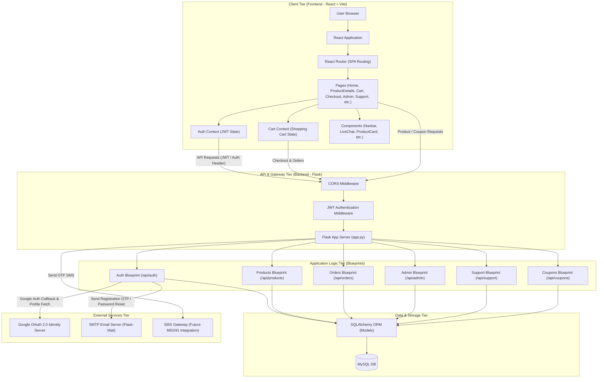
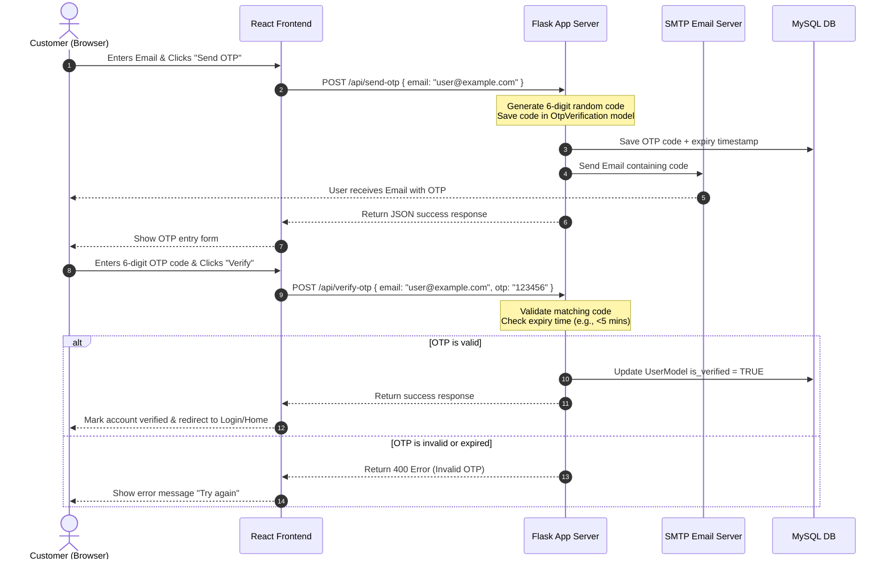
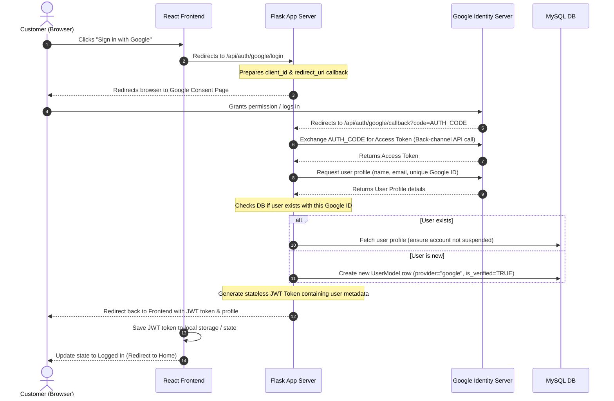
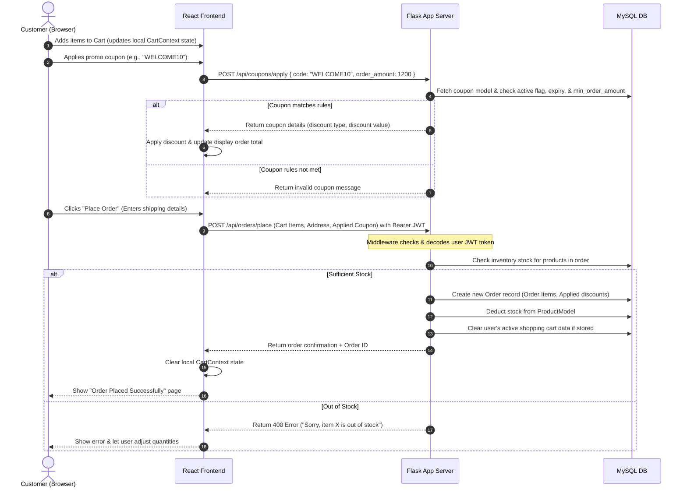
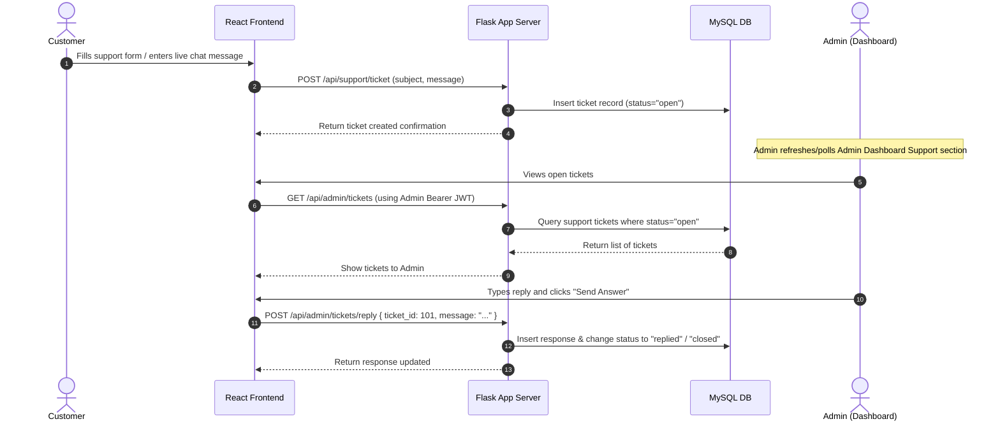

# BharatBasket System Architecture Design Document

Welcome to the architectural overview of **BharatBasket**, a modern e-commerce web application featuring User and Admin panels, a product catalog, shopping cart, coupon discount system, customer support ticketing with live chat, and a robust OTP & Google OAuth 2.0 authentication system.

This document acts as a professional reference guide. It translates the code workflow into intuitive flow diagrams and structured explanations, making it simple to present to anyone—from developers to business leads.

---

## 1. High-Level System Architecture Diagram

This diagram displays the multi-tier architecture of BharatBasket. Each request travels down from the browser through security checkpoints to the logic and database tiers, occasionally communicating with external integrations.

---

## 2. The Tech Stack Breakdown

Here is a summary of the technology stack choices and their role in the platform:

| Tier | Technology | Purpose | Key Details |
| :--- | :--- | :--- | :--- |
| **Frontend** | **React (Vite)** | User Interface (SPA) | Provides a fast, dynamic, and responsive shopping interface with instant state transitions. |
| **Styling** | **TailwindCSS** | Design & Layout | Utility-first styling for a clean, modern grid and responsive mobile/desktop layouts. |
| **State** | **React Context API** | Client-State Management | `AuthContext` holds the logged-in user profile/token; `CartContext` updates cart items dynamically. |
| **Backend** | **Flask (Python)** | REST API Server | Fast, lightweight server framework routing JSON data to blueprints. |
| **Database** | **MySQL** | Persistent Storage | Stores relational data safely (users, products, orders, categories, coupons, tickets). |
| **ORM** | **SQLAlchemy** | Database Mapping | Map Python model objects (`UserModel`, `ProductModel`, etc.) directly to MySQL tables without writing manual SQL query strings. |
| **Auth** | **JWT (JSON Web Tokens)** | Stateless Sessions | Frontend stores a JWT string. It passes this in request headers for authenticated operations (placing orders, editing products). |
| **Notifications** | **SMTP (Flask-Mail)** | Emailing & Verification Codes | Dispatches OTPs (One-Time Passwords) and password reset instructions. |

---

## 3. Core Workflow Sequence Diagrams

### Workflow A: OTP Authentication (Signup / Verification)
When a user signs up or requests verification, the system uses email-based OTPs (with custom options to switch to phone SMS in production).

---

### Workflow B: Google OAuth 2.0 Social Sign-In
To simplify registration and logins, users can authenticate using their Google Account.

---

### Workflow C: Cart & Checkout (Coupon & Order Flow)
How a user builds a cart, applies a discount coupon, and places an order.

---

### Workflow D: Customer Support & Live Chat Ticket
Users can file support tickets or initiate live chats with admins.

---

## 4. Easy Explanation Strategy (Elevator Pitch)

If you need to explain this codebase to a developer, client, or stakeholder, you can use these **three simple concepts**:

### 1. The Separated "Brain" and "Body"
*   **The Frontend (Vite + React) is the "Body":** It is responsible solely for rendering views, keeping the UI fast and snappy, storing the current items you want to buy (using a local React state called `CartContext`), and checking if you are logged in (using `AuthContext`).
*   **The Backend (Flask) is the "Brain":** It runs on a server and handles all logic—verifying logins, validating coupon formulas, calculating order totals, checking database stock, and sending out emails.

### 2. The JWT Passcard (Stateless Security)
*   Instead of the server remembering who you are in a session file, once you log in (either via standard email/OTP verification or Google OAuth), the server hands you a digital passcard called a **JWT (JSON Web Token)**.
*   The frontend stores this JWT card. Every time the frontend calls the backend to place an order, apply a coupon, or fetch dashboard metrics, it places this card in the request headers. The server inspects the card, verifies its digital signature, checks your role (user or admin), and grants access dynamically.

### 3. The ORM Translator (Database communication)
*   We use a MySQL relational database to hold products, users, coupons, and orders.
*   Instead of writing raw, complex database query commands in the code, we use **SQLAlchemy ORM**. It serves as a translator, allowing developers to write simple Python code (e.g. `UserModel.query.filter_by(...)`) to write to and read from MySQL tables, keeping code clean and highly readable.
